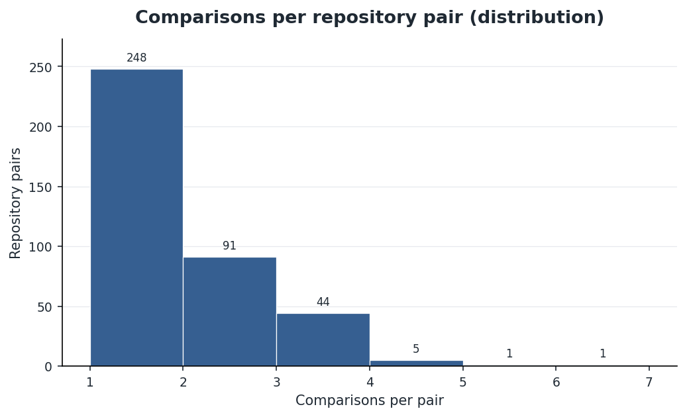
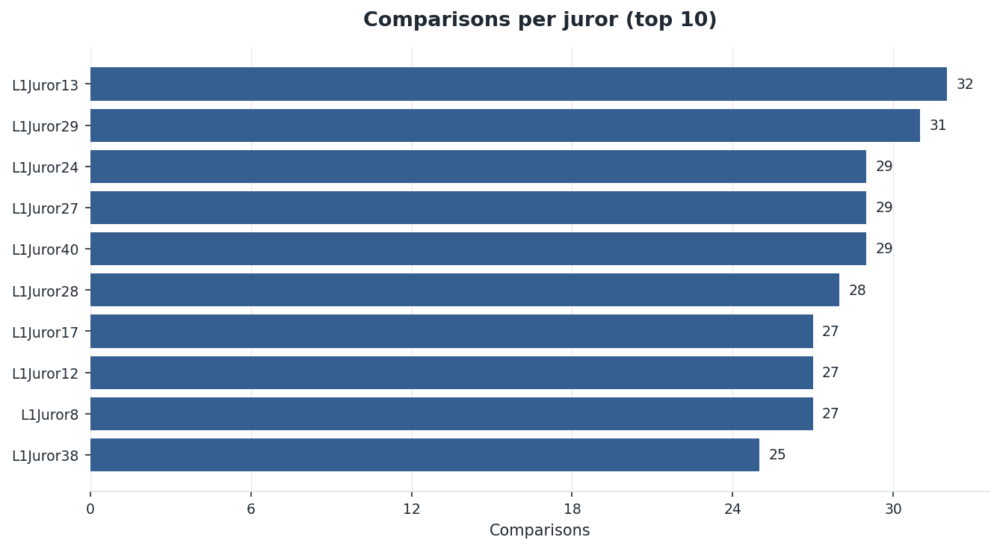
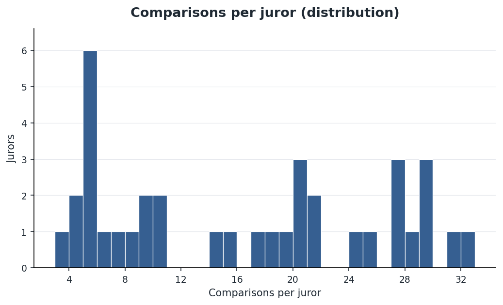
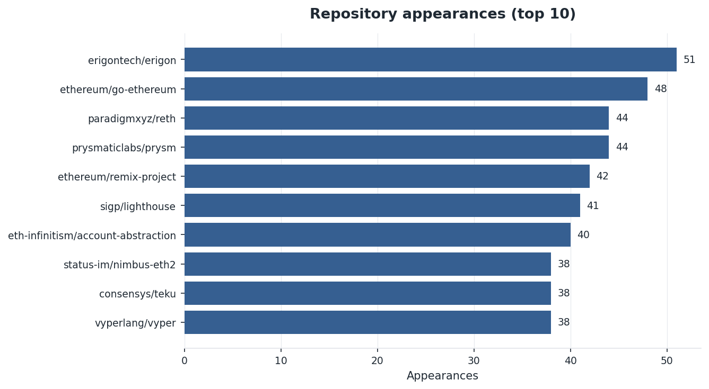
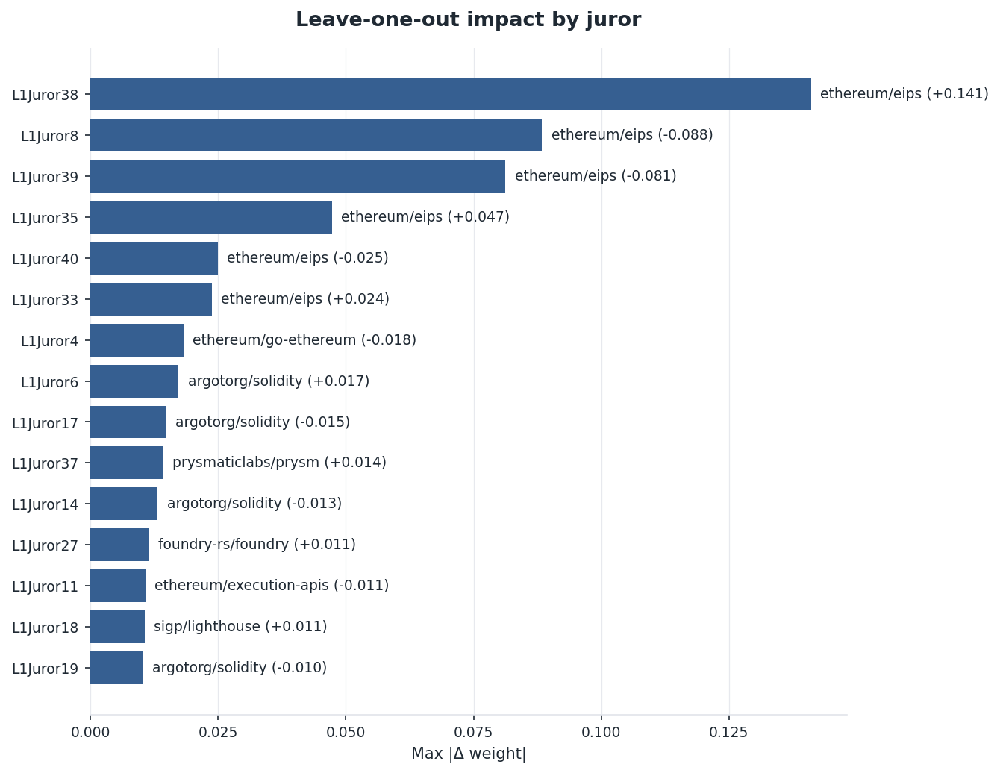
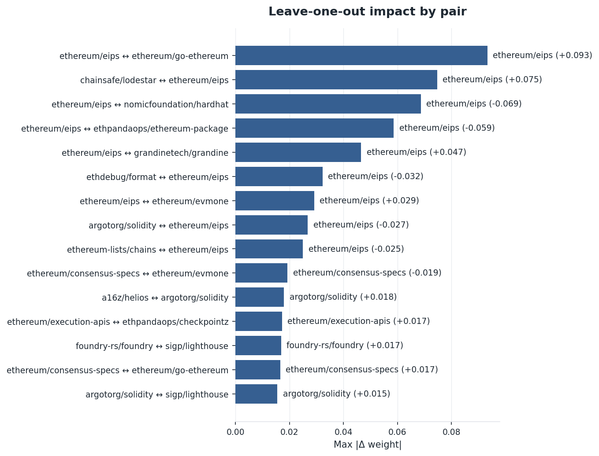
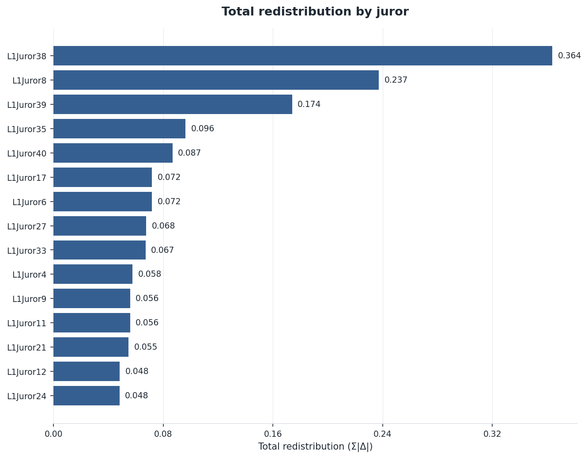
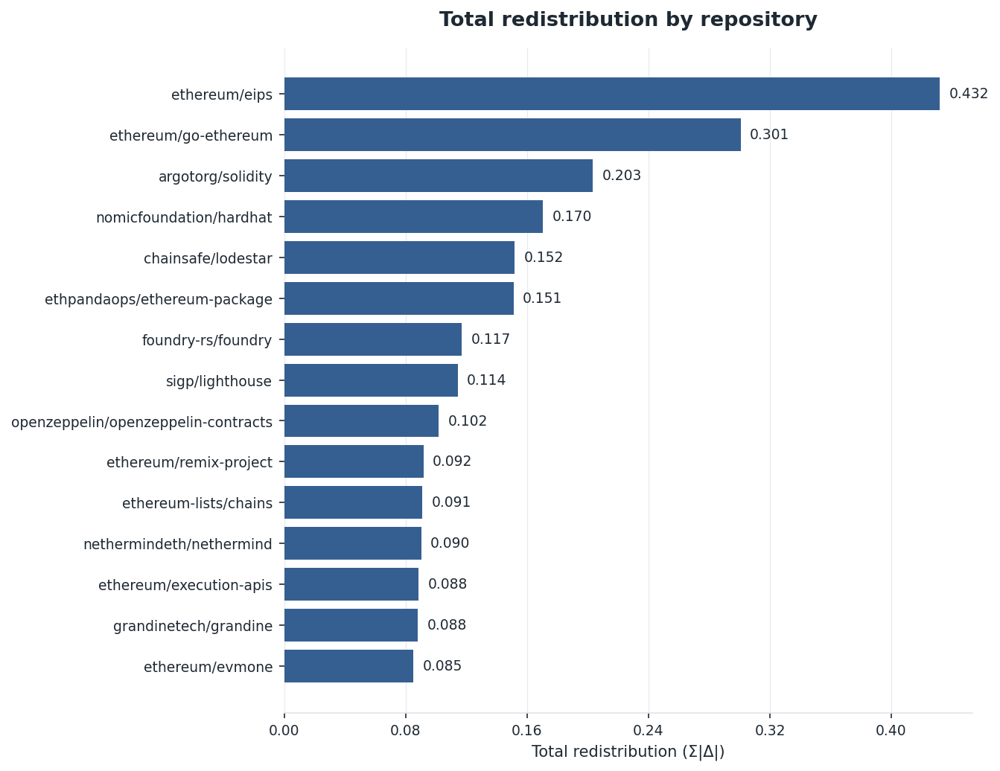
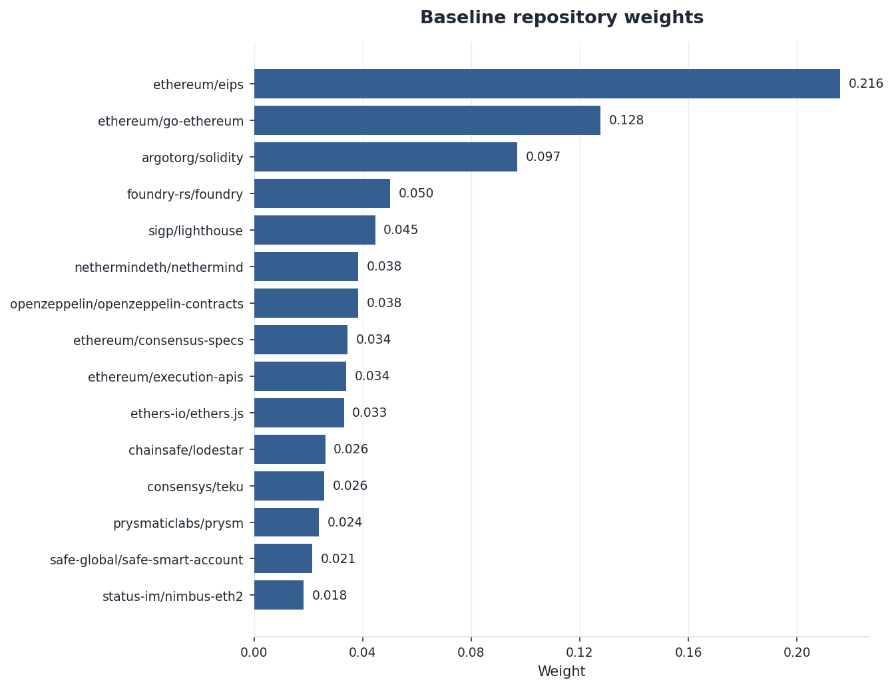
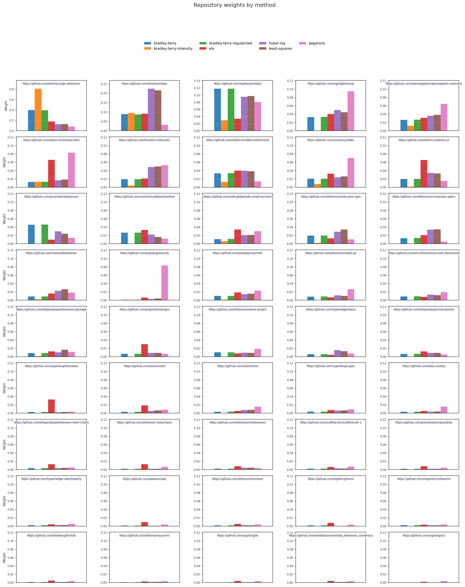

# DeepFunding Trial Data Analysis 🔍

Quick analysys of the DeepFunding trial dataset and a few extra experiments!

## 📦 Dataset

- 593 comparisons across 37 jurors and 45 repositories.
- 390 unique repository pairings; the median pair appears once and only seven pairs surface more than three times, led by the six match argotorg/sourcify versus consensys/teku rivalry.
- Parent track coverage stays singular and both choice labels remain present in the merged dataset.

## 🧑‍⚖️ Juror Participation

- Workload remains concentrated.
  - Top five jurors contribute 25% of all votes, led by `L1Juror13` at 32 comparisons,
  - Five jurors log five or fewer (`L1Juror16` makes only three).

## 🧬 Repository Coverage

- Core execution clients dominate: `erigontech/erigon` enters 51 comparisons, `ethereum/go-ethereum` 48, and both `paradigmxyz/reth` and `prysmaticlabs/prysm` 44 each.
- Despite breadth across 45 repositories, the top five represent 19% of all appearances, keeping the long tail thinly measured.

## 🛡️ Robustness Checks

- Removing any single juror shifts weights modestly except for `L1Juror38`, whose absence lifts `ethereum/eips` by +0.141 (L1 redistribution 0.364).
- Pair-level sensitivity stays anchored on `ethereum/eips`; the `ethereum/eips` ↔ `ethereum/go-ethereum` matchup drives a +0.093 max delta.

## 🚨 Data Quality Signals

- Triangle checks find no order cycles (0 of 9 triangles)
- There are though six intensity loops (66.7%) with inconsistencies (>25% relative error).
  - `L1Juror9`
    - prysmaticlabs/prysm>paradigmxyz/reth (x2.00, n=1) and paradigmxyz/reth>chainsafe/lodestar (x8.00, n=1) imply prysmaticlabs/prysm>chainsafe/lodestar should be x16.00, but recorded x3.00 (n=1) → error 81.2%
  - `L1Juror6`
    - nomicfoundation/hardhat>safe-global/safe-smart-account (x8.00, n=1) and safe-global/safe-smart-account>openzeppelin/openzeppelin-contracts (x3.00, n=1) imply nomicfoundation/hardhat>openzeppelin/openzeppelin-contracts should be x24.00, but recorded x5.00 (n=1) → error 79.2%
- Average absolute side bias sits at 13.2%; L1Juror16 picks "left" 100% of the time (3/3), and four jurors display a 30% skew.

## ⚖️ Weights

### 🪪 Default Method

- [Vitalik's proposed least-squares method](https://github.com/deepfunding/scoring) baseline weights remain top heavy with `ethereum/eips` at 0.216, followed by `ethereum/go-ethereum` (0.128), `argotorg/solidity` (0.097), `foundry-rs/foundry` (0.050), and `sigp/lighthouse` (0.045).
- The top five repositories concentrate 53.5% of total weight; the top ten push that share to 71.3%, leaving the median weight at 0.0093.

## 📐 Distance Functions

Given any set of weights, we can check how "far away" they are from the Jury preferences expressed in the pairwise comparisons themselves.

- `Brier`: mean squared error between each model's predicted win probability and the ground-truth probability inferred from juror multipliers.
- `LogLoss`: negative log-likelihood of the observed outcomes using the model probabilities, clipped to avoid infinities.
- `LogOddsRMSE`: root-mean-square error of the difference between model and ground-truth logits, offering sensitivity to calibration errors in the tails.
- `Accuracy`: share of pairwise comparisons where the model places more weight on the winning repository (ties count as 0.5).
- `Coverage`: fraction of comparisons where both repositories receive non-zero weight from the model.
- `Skill`: relative Brier improvement versus the least-squares baseline, where 0 means parity and 1 denotes a perfect score.
- `TV Drift`: total variation distance between the model's weight distribution and the inferred ground-truth weights.

## 📊 Alternative Weight Methods

I've implemented a few alternative weight distribution methods. Each one produces a different allocation.

| Method                      | Brier ↓ | LogLoss ↓ | LogOddsRMSE ↓ | Accuracy ↑ | Skill ↑ | TV Drift ↓ | Coverage |
| --------------------------- | ------- | --------- | ------------- | ---------- | ------- | ---------- | -------- |
| Least-squares               | 0.0755  | 0.5918    | 2.1928        | 0.759      | +0.4050 | 0.000      | 1.000    |
| Bradley-Terry               | 0.0778  | 0.6379    | 2.7657        | 0.788      | +0.3863 | 0.326      | 1.000    |
| Bradley-Terry (intensity)   | 0.1434  | 1.1744    | 4.2869        | 0.713      | -0.1307 | 0.679      | 1.000    |
| Bradley-Terry (regularized) | 0.0776  | 0.6141    | 2.3428        | 0.789      | +0.3879 | 0.323      | 1.000    |
| Elo                         | 0.1018  | 0.6505    | 2.5045        | 0.705      | +0.1975 | 0.313      | 1.000    |
| Huber-log                   | 0.0748  | 0.5893    | 2.2004        | 0.767      | +0.4104 | 0.035      | 1.000    |
| PageRank                    | 0.1027  | 0.6569    | 2.4879        | 0.685      | +0.1899 | 0.379      | 1.000    |

## 🤖 Models

| Model                         | Brier ↓ | LogLoss ↓ | LogOddsRMSE ↓ | Accuracy ↑ | Skill ↑ | TV Drift ↓ | Coverage |
| ----------------------------- | ------- | --------- | ------------- | ---------- | ------- | ---------- | -------- |
| Jury baseline (least-squares) | 0.0755  | 0.5918    | 2.1928        | 0.759      | +0.4050 | 0.000      | 1.000    |
| Composite ensemble            | 0.0769  | 0.5881    | 2.3134        | 0.769      | +0.3940 | 0.229      | 1.000    |
| Arbitron                      | 0.0881  | 0.6250    | 2.3765        | 0.747      | +0.3056 | 0.261      | 1.000    |
| Final Seer                    | 0.1109  | 1.5480    | 6.9411        | 0.727      | +0.1254 | 0.226      | 1.000    |
